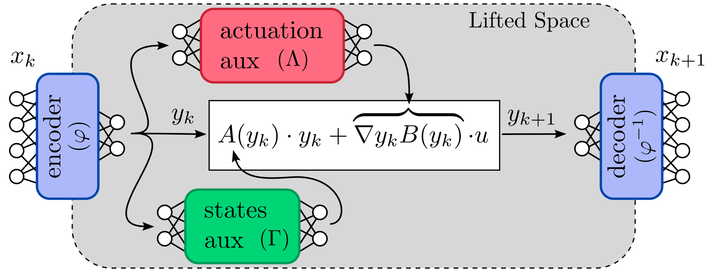
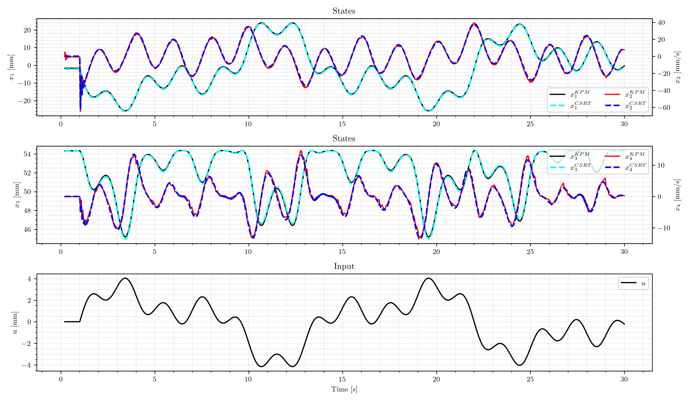

# Deep Koopman Model for Tendon-Driven Catheters

This repository contains the implementation of a deep Koopman-based model for a tendon-driven catheter. The model leverages a ground truth Cosserat Rod model to generate the dataset for calibration. Calibration processes have been specifically conducted for the bending section of the Biosense Webster Thermocouple Ablation catheter. The model accepts tendon displacement as input and computes the system states, including the position and velocity of the distal end within the actuation plane, rendering the model's operation in 2D.

## Building Requirements

To build and run the model successfully, ensure that the following libraries are installed on your system:

### for Deep Koopman model (lib_predictor):

* [Libtorch](https://pytorch.org/) - C++ library for PyTorch
* [Blaze Library](https://bitbucket.org/blaze-lib/blaze/src/master/)

### for Cosserat's Rod model (tendon_library):

* [Boost](https://www.boost.org/)
* [Blaze Library](https://bitbucket.org/blaze-lib/blaze/src/master/)
* [LAPACK](http://www.netlib.org/lapack/)
* [NLopt](https://nlopt.readthedocs.io/en/latest/)

## Uage notes

Tendon actaution must be limited to ±5 mm.

## Results

